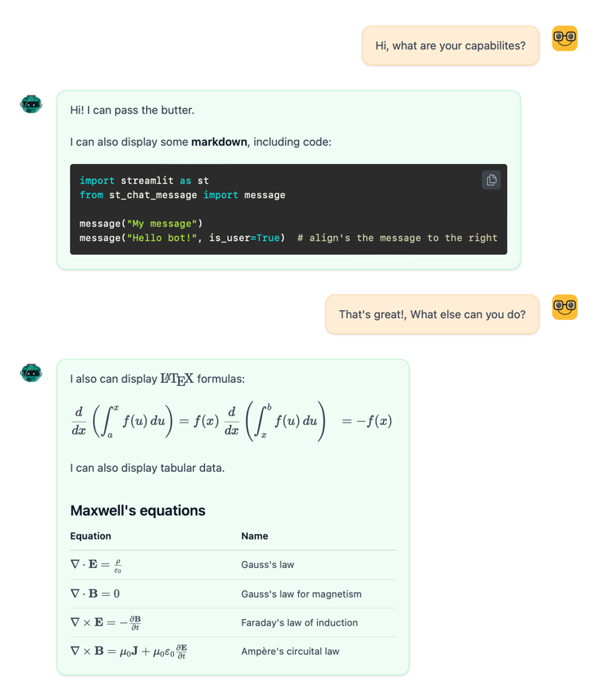

# ST-CHAT-MESSAGE

## Description

This is a simple chat message component for streamlit. It is based on the [streamlit-chat](https://github.com/AI-Yash/st-chat) component, trying to be as compatible as possible, but it adding a few features:

- Markdown support
- LaTeX support
- Tables

## Installation

```bash
pip install st-chat-message
```

or

```bash
poetry add st-chat-message
```
## Usage

```python
import streamlit as st
from st_chat_message import message

message("Hello world!", is_user=True)
message("Hi")
```

